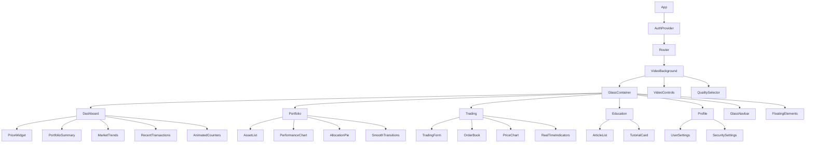
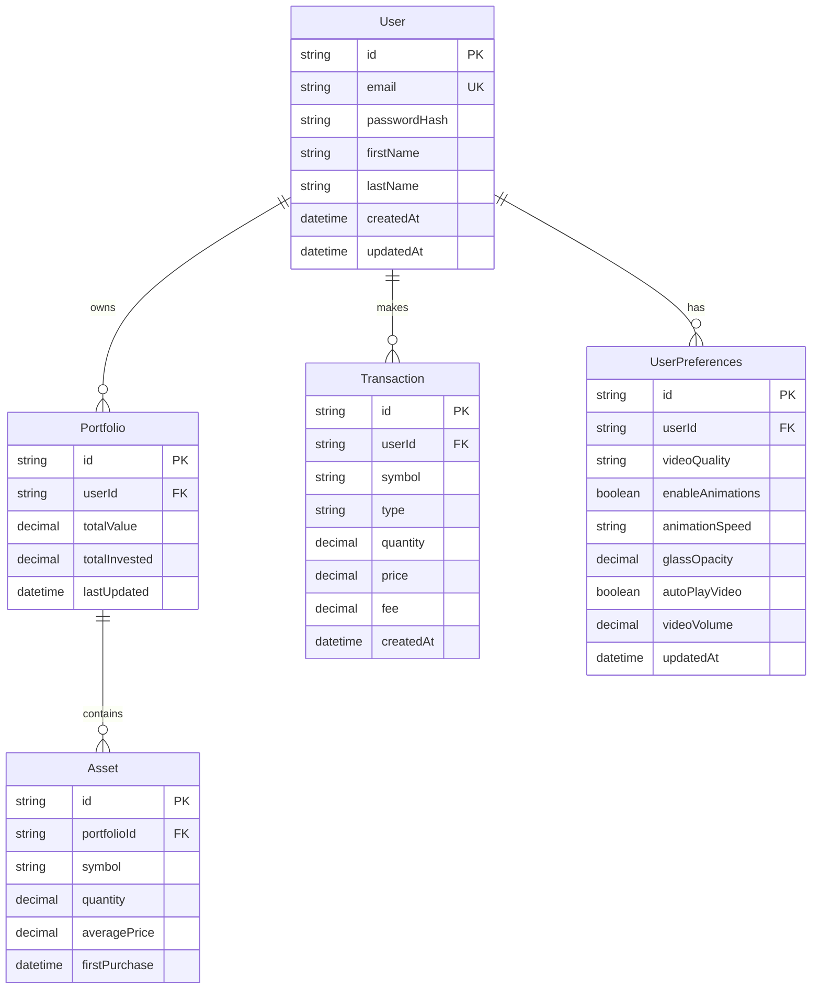
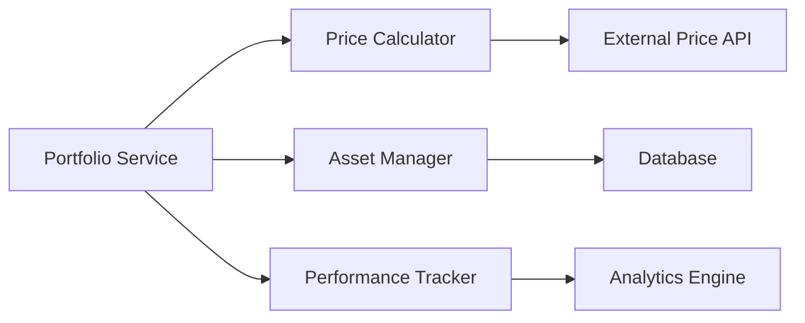
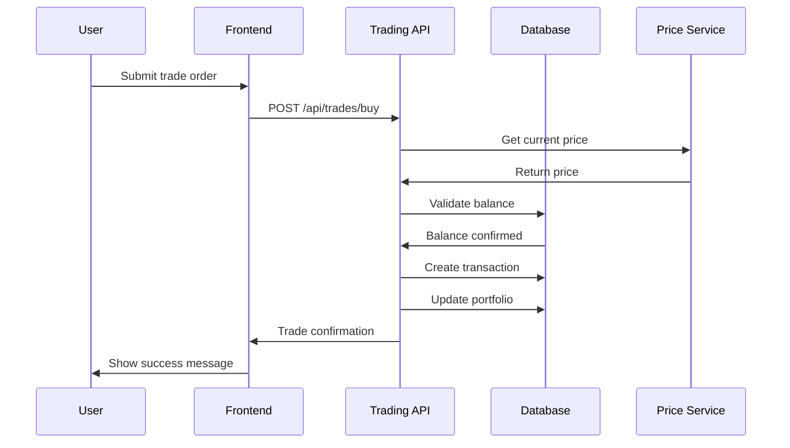

# Crypto Investment Platform MVP Design

## Overview

The Crypto Investment Platform is a full-stack web application that enables users to invest in cryptocurrencies with a simplified, user-friendly interface. The MVP focuses on core investment functionality including portfolio management, real-time price tracking, basic trading capabilities, and educational resources for new crypto investors.

### Key Features
- User authentication and profile management
- Real-time cryptocurrency price tracking with live video background
- Portfolio management and analytics with smooth animations
- Basic buy/sell trading functionality
- Investment recommendations for beginners
- Educational content and market insights
- Immersive video background experience
- Smooth transitions and micro-interactions
- Glass morphism UI design over video background
- Responsive web design for desktop and mobile

### Target Users
- Crypto investment beginners
- Casual investors seeking simplified trading
- Users who want portfolio tracking and analytics

## Technology Stack & Dependencies

### Frontend Stack
- **Framework**: React 18 with TypeScript
- **Styling**: Tailwind CSS with shadcn/ui components + Custom CSS for glass morphism
- **State Management**: Zustand for global state
- **Charts**: Chart.js for price charts and portfolio analytics
- **HTTP Client**: Axios for API communications
- **Routing**: React Router v6
- **Form Handling**: React Hook Form with Zod validation
- **Real-time Data**: WebSocket connection for live prices
- **Animations**: Framer Motion for smooth transitions
- **Video Background**: HTML5 Video API with WebRTC for live streaming
- **Performance**: React.memo and useMemo for optimized rendering over video

### Backend Stack
- **Runtime**: Node.js with Express.js
- **Database**: PostgreSQL with Prisma ORM
- **Authentication**: JWT with refresh tokens
- **External APIs**: CoinGecko API for crypto data
- **Payment Processing**: Stripe for fiat transactions
- **WebSocket**: Socket.io for real-time updates
- **Security**: Helmet, CORS, rate limiting

## Frontend Architecture

### Component Hierarchy



### Component Definition

#### Core Layout Components
- **App**: Root component with theme and auth providers
- **VideoBackground**: Full-screen video background with live streaming capability
- **GlassContainer**: Semi-transparent container with glass morphism effects
- **GlassNavbar**: Navigation with glass effect and real-time balance
- **FloatingElements**: Animated floating particles and crypto symbols
- **Footer**: Legal links and company information with glass overlay

#### Video Background Components
- **VideoBackground**: Main video container with multiple source support
- **VideoControls**: Play/pause, volume, and quality controls
- **QualitySelector**: Auto-adaptive quality based on connection speed
- **StreamStatus**: Live connection indicator and fallback handling

#### Dashboard Components
- **PriceWidget**: Real-time crypto prices with smooth number animations
- **PortfolioSummary**: Total portfolio value with glass card effects
- **MarketTrends**: Top gainers/losers with animated progress bars
- **RecentTransactions**: Latest activities with slide-in animations
- **AnimatedCounters**: Smooth counting animations for portfolio metrics
- **RealTimeIndicators**: Live pulse effects for active trading pairs

#### Enhanced Portfolio Components
- **AssetList**: Table with hover effects and smooth row animations
- **PerformanceChart**: Interactive chart with glass overlay controls
- **AllocationPie**: 3D-style pie chart with smooth transitions
- **SmoothTransitions**: Page transition effects between portfolio views

#### Trading Components
- **TradingForm**: Buy/sell form with amount and price validation
- **PriceChart**: Candlestick chart with technical indicators
- **OrderBook**: Live order book data (read-only for MVP)

### Props/State Management

#### Global State (Zustand)
```typescript
interface AppState {
  user: User | null;
  portfolio: Portfolio;
  cryptoPrices: Record<string, number>;
  isLoading: boolean;
  error: string | null;
  
  // Video background state
  videoSrc: string;
  videoQuality: 'auto' | 'high' | 'medium' | 'low';
  isVideoPlaying: boolean;
  videoVolume: number;
  showVideoControls: boolean;
  
  // Animation preferences
  enableAnimations: boolean;
  animationSpeed: 'slow' | 'normal' | 'fast';
  glassOpacity: number;
  
  // Actions
  setUser: (user: User) => void;
  updatePortfolio: (portfolio: Portfolio) => void;
  updatePrices: (prices: Record<string, number>) => void;
  setLoading: (loading: boolean) => void;
  setError: (error: string | null) => void;
  
  // Video actions
  setVideoSrc: (src: string) => void;
  toggleVideo: () => void;
  setVideoQuality: (quality: string) => void;
  setVideoVolume: (volume: number) => void;
  
  // Animation actions
  toggleAnimations: () => void;
  setAnimationSpeed: (speed: string) => void;
  setGlassOpacity: (opacity: number) => void;
}
```

#### Component Props Examples
```typescript
interface VideoBackgroundProps {
  src: string;
  fallbackImage?: string;
  autoPlay?: boolean;
  loop?: boolean;
  muted?: boolean;
  quality?: 'auto' | 'high' | 'medium' | 'low';
  onLoadStart?: () => void;
  onCanPlay?: () => void;
  onError?: (error: Error) => void;
}

interface GlassContainerProps {
  children: React.ReactNode;
  opacity?: number;
  blur?: number;
  className?: string;
  animationDelay?: number;
}

interface PriceWidgetProps {
  symbol: string;
  showChart?: boolean;
  size?: 'sm' | 'md' | 'lg';
  animateNumbers?: boolean;
  glassEffect?: boolean;
}

interface TradingFormProps {
  symbol: string;
  currentPrice: number;
  onSubmit: (order: TradeOrder) => Promise<void>;
  showAnimations?: boolean;
  glassStyle?: boolean;
}

interface AnimatedCounterProps {
  value: number;
  duration?: number;
  prefix?: string;
  suffix?: string;
  decimals?: number;
}
```

### Lifecycle Methods/Hooks

#### Custom Hooks
- **useAuth**: Handle authentication state and methods
- **useWebSocket**: Manage real-time price connections
- **usePortfolio**: Portfolio data fetching and management
- **useCryptoPrices**: Real-time price updates
- **useLocalStorage**: Persist user preferences
- **useVideoBackground**: Manage video playback and quality
- **useAnimations**: Control smooth transitions and effects
- **useGlassMorphism**: Manage glass effect opacity and blur
- **useCountAnimation**: Smooth number counting animations
- **useIntersectionObserver**: Trigger animations on scroll

### Component Usage Examples

```typescript
// Video Background Setup
<VideoBackground
  src="https://stream.example.com/crypto-live"
  fallbackImage="/crypto-bg.jpg"
  autoPlay={true}
  loop={true}
  muted={true}
  quality="auto"
  onLoadStart={() => console.log('Video loading...')}
  onCanPlay={() => console.log('Video ready')}
/>

// Glass Container with Dashboard
<GlassContainer opacity={0.15} blur={20} animationDelay={0.2}>
  <Dashboard>
    <PriceWidget 
      symbol="BTC" 
      showChart={true} 
      size="lg" 
      animateNumbers={true}
      glassEffect={true}
    />
    <PortfolioSummary 
      totalValue={portfolio.totalValue}
      dailyChange={portfolio.dailyChange}
      showAnimations={true}
    />
  </Dashboard>
</GlassContainer>

// Animated Counter
<AnimatedCounter
  value={45000}
  duration={2000}
  prefix="$"
  decimals={2}
/>

// Trading form with glass effect
<TradingForm
  symbol="ETH"
  currentPrice={cryptoPrices.ETH}
  onSubmit={handleTradeSubmit}
  showAnimations={true}
  glassStyle={true}
/>

// Floating elements overlay
<FloatingElements>
  <FloatingIcon icon="₿" delay={0} />
  <FloatingIcon icon="Ξ" delay={1} />
  <FloatingIcon icon="💎" delay={2} />
</FloatingElements>
```

## Backend Architecture

### API Endpoints Reference

#### Authentication Endpoints
```
POST /api/auth/register
POST /api/auth/login
POST /api/auth/logout
POST /api/auth/refresh
GET  /api/auth/profile
PUT  /api/auth/profile
```

#### Portfolio Endpoints
```
GET  /api/portfolio
GET  /api/portfolio/history
GET  /api/portfolio/performance
```

#### Trading Endpoints
```
POST /api/trades/buy
POST /api/trades/sell
GET  /api/trades/history
GET  /api/trades/orders
```

#### Market Data Endpoints
```
GET  /api/crypto/prices
GET  /api/crypto/charts/:symbol
GET  /api/crypto/trending
```

#### Media & Streaming Endpoints
```
GET  /api/media/background-video
GET  /api/media/video-qualities
POST /api/media/set-quality
GET  /api/media/stream-status
WS   /ws/video-stream
```

### Request/Response Schema

#### Trade Order Request
```json
{
  "symbol": "BTC",
  "type": "buy",
  "amount": 0.1,
  "price": 45000
}
```

#### Portfolio Response
```json
{
  "totalValue": 12500.00,
  "dailyChange": 2.5,
  "assets": [
    {
      "symbol": "BTC",
      "quantity": 0.25,
      "currentPrice": 45000,
      "value": 11250,
      "change24h": 3.2
    }
  ]
}
```

### Authentication Requirements
- JWT tokens with 15-minute expiry
- Refresh tokens with 7-day expiry
- Protected routes require valid JWT
- Rate limiting: 100 requests per minute per IP

## Data Models & ORM Mapping

### Database Schema



### Prisma Models

```typescript
model User {
  id          String   @id @default(cuid())
  email       String   @unique
  passwordHash String
  firstName   String
  lastName    String
  portfolio   Portfolio?
  transactions Transaction[]
  preferences UserPreferences?
  createdAt   DateTime @default(now())
  updatedAt   DateTime @updatedAt
}

model UserPreferences {
  id             String  @id @default(cuid())
  userId         String  @unique
  user           User    @relation(fields: [userId], references: [id])
  videoQuality   String  @default("auto") // auto, high, medium, low
  enableAnimations Boolean @default(true)
  animationSpeed String  @default("normal") // slow, normal, fast
  glassOpacity   Decimal @default(0.15)
  autoPlayVideo  Boolean @default(true)
  videoVolume    Decimal @default(0.3)
  updatedAt      DateTime @updatedAt
}

model Portfolio {
  id            String   @id @default(cuid())
  userId        String   @unique
  user          User     @relation(fields: [userId], references: [id])
  totalValue    Decimal  @default(0)
  totalInvested Decimal  @default(0)
  assets        Asset[]
  lastUpdated   DateTime @updatedAt
}

model Asset {
  id           String    @id @default(cuid())
  portfolioId  String
  portfolio    Portfolio @relation(fields: [portfolioId], references: [id])
  symbol       String
  quantity     Decimal
  averagePrice Decimal
  firstPurchase DateTime @default(now())
  
  @@unique([portfolioId, symbol])
}

model Transaction {
  id        String   @id @default(cuid())
  userId    String
  user      User     @relation(fields: [userId], references: [id])
  symbol    String
  type      String   // 'buy' | 'sell'
  quantity  Decimal
  price     Decimal
  fee       Decimal  @default(0)
  createdAt DateTime @default(now())
}
```

## Business Logic Layer

### Portfolio Management Service



#### Core Functions
- **calculatePortfolioValue**: Aggregate real-time asset values
- **updateAssetQuantities**: Handle buy/sell transactions
- **trackPerformance**: Calculate gains/losses and percentages
- **rebalanceRecommendations**: Suggest portfolio optimization

### Trading Service

#### Trade Execution Flow


#### Business Rules
- Minimum trade amount: $10 USD
- Maximum trade amount: $10,000 USD for MVP
- Trading fees: 0.5% per transaction
- Balance validation before trade execution
- Real-time price validation (±2% tolerance)

### User Management Service

#### Features
- User registration with email verification
- Secure password hashing (bcrypt)
- Profile management
- Account security settings
- Transaction history tracking

## Routing & Navigation

### Route Structure
```
/ (Dashboard)
├── /portfolio
├── /trade/:symbol?
├── /education
│   ├── /education/articles
│   └── /education/tutorials
├── /profile
│   ├── /profile/settings
│   └── /profile/security
└── /auth
    ├── /auth/login
    └── /auth/register
```

### Protected Routes
- All routes except `/auth/*` require authentication
- Dashboard redirects to login if not authenticated
- Automatic redirect after login to intended route

### Navigation Components
```typescript
<BrowserRouter>
  <Routes>
    <Route path="/auth/*" element={<AuthRoutes />} />
    <Route path="/*" element={
      <ProtectedRoute>
        <AppLayout />
      </ProtectedRoute>
    } />
  </Routes>
</BrowserRouter>
```

## Styling Strategy

### Glass Morphism Design System
```css
/* Glass morphism base styles */
.glass {
  background: rgba(255, 255, 255, 0.15);
  backdrop-filter: blur(20px);
  -webkit-backdrop-filter: blur(20px);
  border: 1px solid rgba(255, 255, 255, 0.2);
  border-radius: 16px;
  box-shadow: 0 8px 32px rgba(0, 0, 0, 0.1);
}

.glass-dark {
  background: rgba(0, 0, 0, 0.15);
  backdrop-filter: blur(20px);
  -webkit-backdrop-filter: blur(20px);
  border: 1px solid rgba(255, 255, 255, 0.1);
}

/* Video background styles */
.video-background {
  position: fixed;
  top: 0;
  left: 0;
  width: 100vw;
  height: 100vh;
  object-fit: cover;
  z-index: -1;
  opacity: 0.8;
  transition: opacity 0.3s ease;
}

.video-overlay {
  position: fixed;
  top: 0;
  left: 0;
  width: 100%;
  height: 100%;
  background: linear-gradient(
    135deg,
    rgba(16, 185, 129, 0.1) 0%,
    rgba(59, 130, 246, 0.1) 100%
  );
  z-index: 0;
  pointer-events: none;
}
```

### Tailwind CSS Configuration
- Custom color palette for crypto theme with transparency support
- Dark/light mode support with glass effect variations
- Responsive breakpoints for mobile-first design
- Custom animations for smooth transitions
- Backdrop blur utilities for glass morphism

### Enhanced Color Palette
```css
:root {
  --primary: #10B981; /* Green for gains */
  --primary-glass: rgba(16, 185, 129, 0.15);
  --danger: #EF4444;  /* Red for losses */
  --danger-glass: rgba(239, 68, 68, 0.15);
  --warning: #F59E0B; /* Orange for warnings */
  --warning-glass: rgba(245, 158, 11, 0.15);
  --background: rgba(249, 250, 251, 0.05);
  --surface: rgba(255, 255, 255, 0.1);
  --surface-glass: rgba(255, 255, 255, 0.15);
  --text-primary: #111827;
  --text-secondary: #6B7280;
  --glass-border: rgba(255, 255, 255, 0.2);
  --backdrop-blur: blur(20px);
}

[data-theme="dark"] {
  --background: rgba(17, 24, 39, 0.1);
  --surface: rgba(31, 41, 55, 0.15);
  --surface-glass: rgba(0, 0, 0, 0.15);
  --text-primary: #F9FAFB;
  --text-secondary: #9CA3AF;
  --glass-border: rgba(255, 255, 255, 0.1);
}
```

### Animation Classes
```css
/* Smooth entrance animations */
@keyframes slideInFromBottom {
  from {
    transform: translateY(100px);
    opacity: 0;
  }
  to {
    transform: translateY(0);
    opacity: 1;
  }
}

@keyframes floatUp {
  0% {
    transform: translateY(0px) rotate(0deg);
    opacity: 0.7;
  }
  50% {
    transform: translateY(-20px) rotate(180deg);
    opacity: 1;
  }
  100% {
    transform: translateY(-40px) rotate(360deg);
    opacity: 0;
  }
}

@keyframes pulseGlow {
  0%, 100% {
    box-shadow: 0 0 20px rgba(16, 185, 129, 0.3);
  }
  50% {
    box-shadow: 0 0 40px rgba(16, 185, 129, 0.6);
  }
}

.animate-slide-in {
  animation: slideInFromBottom 0.6s ease-out;
}

.animate-float {
  animation: floatUp 6s infinite linear;
}

.animate-pulse-glow {
  animation: pulseGlow 2s infinite;
}
```

### Responsive Design
- Mobile-first approach with progressive enhancement
- Collapsible sidebar for mobile navigation
- Optimized charts and tables for small screens
- Touch-friendly buttons and interactions

## State Management

### Zustand Store Structure

```typescript
interface AppState {
  // User state
  user: User | null;
  isAuthenticated: boolean;
  
  // Portfolio state
  portfolio: Portfolio;
  assets: Asset[];
  totalValue: number;
  dailyChange: number;
  
  // Market data
  cryptoPrices: Map<string, CryptoPrice>;
  marketTrends: MarketTrend[];
  
  // Video background state
  videoBackground: {
    src: string;
    isPlaying: boolean;
    volume: number;
    quality: 'auto' | 'high' | 'medium' | 'low';
    showControls: boolean;
    isLoading: boolean;
    error: string | null;
  };
  
  // Animation preferences
  animations: {
    enabled: boolean;
    speed: 'slow' | 'normal' | 'fast';
    glassOpacity: number;
    particlesEnabled: boolean;
    transitionDuration: number;
  };
  
  // UI state
  theme: 'light' | 'dark';
  sidebarCollapsed: boolean;
  activeChartSymbol: string;
  showFloatingElements: boolean;
  
  // Loading states
  isLoadingPortfolio: boolean;
  isLoadingPrices: boolean;
  
  // Actions
  setUser: (user: User) => void;
  updatePortfolio: (portfolio: Portfolio) => void;
  updateCryptoPrices: (prices: Map<string, CryptoPrice>) => void;
  
  // Video actions
  setVideoSrc: (src: string) => void;
  toggleVideoPlayback: () => void;
  setVideoQuality: (quality: string) => void;
  setVideoVolume: (volume: number) => void;
  toggleVideoControls: () => void;
  
  // Animation actions
  toggleAnimations: () => void;
  setAnimationSpeed: (speed: string) => void;
  setGlassOpacity: (opacity: number) => void;
  toggleParticles: () => void;
  
  // UI actions
  toggleTheme: () => void;
  toggleSidebar: () => void;
  setActiveChart: (symbol: string) => void;
  toggleFloatingElements: () => void;
}
```

### State Persistence
- User preferences stored in localStorage
- Authentication tokens in httpOnly cookies
- Portfolio data synced with backend
- Real-time data through WebSocket subscriptions

## API Integration Layer

### HTTP Client Configuration
```typescript
const apiClient = axios.create({
  baseURL: process.env.REACT_APP_API_URL,
  timeout: 10000,
  headers: {
    'Content-Type': 'application/json',
  },
});

// Request interceptor for auth tokens
apiClient.interceptors.request.use((config) => {
  const token = getAuthToken();
  if (token) {
    config.headers.Authorization = `Bearer ${token}`;
  }
  return config;
});

// Response interceptor for error handling
apiClient.interceptors.response.use(
  (response) => response,
  (error) => {
    if (error.response?.status === 401) {
      // Handle token expiry
      refreshToken();
    }
    return Promise.reject(error);
  }
);
```

### Enhanced WebSocket Integration
```typescript
class WebSocketService {
  private socket: Socket;
  private videoSocket: Socket;
  
  connect() {
    this.socket = io(process.env.REACT_APP_WS_URL, {
      auth: { token: getAuthToken() }
    });
    
    this.socket.on('priceUpdate', (data) => {
      useAppStore.getState().updateCryptoPrices(data);
    });
    
    this.socket.on('portfolioUpdate', (data) => {
      useAppStore.getState().updatePortfolio(data);
    });
  }
  
  connectVideoStream() {
    this.videoSocket = io(process.env.REACT_APP_VIDEO_WS_URL);
    
    this.videoSocket.on('videoQualityUpdate', (qualities) => {
      // Update available quality options
    });
    
    this.videoSocket.on('streamStatus', (status) => {
      // Handle stream connection status
    });
  }
  
  subscribeToPrices(symbols: string[]) {
    this.socket.emit('subscribe', { symbols });
  }
  
  requestVideoQuality(quality: string) {
    this.videoSocket.emit('changeQuality', { quality });
  }
}

class VideoStreamService {
  private videoElement: HTMLVideoElement | null = null;
  private mediaSource: MediaSource | null = null;
  
  async initializeStream(element: HTMLVideoElement, src: string) {
    this.videoElement = element;
    
    if (this.isHLSSupported()) {
      await this.setupHLSStream(src);
    } else {
      await this.setupFallbackStream(src);
    }
  }
  
  private isHLSSupported(): boolean {
    return !!document.createElement('video').canPlayType('application/vnd.apple.mpegurl');
  }
  
  private async setupHLSStream(src: string) {
    // HLS streaming implementation for live video
    const video = this.videoElement!;
    video.src = src;
    
    video.addEventListener('loadstart', () => {
      useAppStore.getState().videoBackground.isLoading = true;
    });
    
    video.addEventListener('canplay', () => {
      useAppStore.getState().videoBackground.isLoading = false;
    });
  }
  
  private async setupFallbackStream(src: string) {
    // Fallback for browsers without HLS support
    const video = this.videoElement!;
    video.src = src;
  }
  
  changeQuality(quality: string) {
    const baseUrl = this.getBaseStreamUrl();
    const qualityUrl = `${baseUrl}/${quality}/index.m3u8`;
    
    if (this.videoElement) {
      const currentTime = this.videoElement.currentTime;
      this.videoElement.src = qualityUrl;
      this.videoElement.currentTime = currentTime;
    }
  }
  
  private getBaseStreamUrl(): string {
    return process.env.REACT_APP_STREAM_BASE_URL || '';
  }
}
```

### External API Integration
- **CoinGecko API**: Real-time crypto prices and market data
- **Stripe API**: Payment processing for fiat deposits
- **Email Service**: User notifications and alerts
- **Rate Limiting**: Implement caching to respect API limits

## Testing Strategy

### Frontend Testing
```typescript
// Video Background component testing
describe('VideoBackground', () => {
  it('should load and play video automatically', async () => {
    const mockVideoSrc = 'https://stream.example.com/test.m3u8';
    render(<VideoBackground src={mockVideoSrc} autoPlay={true} />);
    
    const video = screen.getByTestId('background-video');
    expect(video).toHaveAttribute('src', mockVideoSrc);
    expect(video).toHaveAttribute('autoplay');
  });
  
  it('should handle video loading errors gracefully', async () => {
    const onError = jest.fn();
    render(
      <VideoBackground 
        src="invalid-url" 
        fallbackImage="/fallback.jpg"
        onError={onError}
      />
    );
    
    const video = screen.getByTestId('background-video');
    fireEvent.error(video);
    
    expect(onError).toHaveBeenCalled();
    expect(screen.getByTestId('fallback-image')).toBeInTheDocument();
  });
});

// Glass morphism component testing
describe('GlassContainer', () => {
  it('should apply correct opacity and blur values', () => {
    render(
      <GlassContainer opacity={0.2} blur={15}>
        <div>Test content</div>
      </GlassContainer>
    );
    
    const container = screen.getByTestId('glass-container');
    expect(container).toHaveStyle({
      'background-color': 'rgba(255, 255, 255, 0.2)',
      'backdrop-filter': 'blur(15px)'
    });
  });
});

// Animated counter testing
describe('AnimatedCounter', () => {
  it('should animate from 0 to target value', async () => {
    render(<AnimatedCounter value={1000} duration={1000} />);
    
    const counter = screen.getByTestId('animated-counter');
    expect(counter).toHaveTextContent('0');
    
    await waitFor(() => {
      expect(counter).toHaveTextContent('1000');
    }, { timeout: 1500 });
  });
});

// Enhanced trading form testing
describe('TradingForm', () => {
  it('should submit valid trade order with animations', async () => {
    render(
      <TradingForm 
        symbol="BTC" 
        currentPrice={45000} 
        onSubmit={mockSubmit}
        showAnimations={true}
        glassStyle={true}
      />
    );
    
    await user.type(screen.getByLabelText(/amount/i), '0.1');
    await user.click(screen.getByRole('button', { name: /buy/i }));
    
    expect(mockSubmit).toHaveBeenCalledWith({
      symbol: 'BTC',
      type: 'buy',
      amount: 0.1,
      price: 45000
    });
    
    // Check for success animation
    expect(screen.getByTestId('success-animation')).toBeInTheDocument();
  });
});

// Video streaming hook testing
describe('useVideoBackground', () => {
  it('should manage video state correctly', async () => {
    const { result } = renderHook(() => useVideoBackground());
    
    act(() => {
      result.current.setVideoSrc('https://stream.example.com/live');
    });
    
    expect(result.current.videoSrc).toBe('https://stream.example.com/live');
    expect(result.current.isLoading).toBe(true);
    
    act(() => {
      result.current.onVideoLoad();
    });
    
    expect(result.current.isLoading).toBe(false);
  });
});

// Animation hook testing
describe('useAnimations', () => {
  it('should control animation states', () => {
    const { result } = renderHook(() => useAnimations());
    
    expect(result.current.enabled).toBe(true);
    
    act(() => {
      result.current.toggleAnimations();
    });
    
    expect(result.current.enabled).toBe(false);
  });
});
```

### Backend Testing
```typescript
// Enhanced API endpoint testing
describe('POST /api/trades/buy', () => {
  it('should create buy order with valid data', async () => {
    const response = await request(app)
      .post('/api/trades/buy')
      .set('Authorization', `Bearer ${authToken}`)
      .send({
        symbol: 'BTC',
        amount: 0.1,
        price: 45000
      });
    
    expect(response.status).toBe(201);
    expect(response.body.transaction).toBeDefined();
  });
});

// Video streaming endpoints testing
describe('GET /api/media/background-video', () => {
  it('should return available video sources', async () => {
    const response = await request(app)
      .get('/api/media/background-video')
      .set('Authorization', `Bearer ${authToken}`);
    
    expect(response.status).toBe(200);
    expect(response.body).toHaveProperty('sources');
    expect(response.body.sources).toBeInstanceOf(Array);
  });
});

describe('POST /api/media/set-quality', () => {
  it('should update user video quality preference', async () => {
    const response = await request(app)
      .post('/api/media/set-quality')
      .set('Authorization', `Bearer ${authToken}`)
      .send({ quality: 'high' });
    
    expect(response.status).toBe(200);
    expect(response.body.preferences.videoQuality).toBe('high');
  });
});

// User preferences testing
describe('UserPreferences Service', () => {
  it('should update animation preferences', async () => {
    const userId = 'test-user-id';
    const preferences = {
      enableAnimations: false,
      animationSpeed: 'slow',
      glassOpacity: 0.3
    };
    
    const result = await UserPreferencesService.updatePreferences(userId, preferences);
    
    expect(result.enableAnimations).toBe(false);
    expect(result.animationSpeed).toBe('slow');
    expect(result.glassOpacity).toBe(0.3);
  });
});

// Enhanced service layer testing
describe('PortfolioService', () => {
  it('should calculate portfolio value correctly', () => {
    const assets = [
      { symbol: 'BTC', quantity: 0.5, currentPrice: 45000 },
      { symbol: 'ETH', quantity: 2, currentPrice: 3000 }
    ];
    
    const totalValue = PortfolioService.calculateValue(assets);
    expect(totalValue).toBe(28500); // (0.5 * 45000) + (2 * 3000)
  });
  
  it('should handle real-time price updates', async () => {
    const mockPrices = { BTC: 46000, ETH: 3100 };
    
    await PortfolioService.updatePrices(mockPrices);
    
    const portfolio = await PortfolioService.getPortfolio('user-id');
    expect(portfolio.totalValue).toBe(29200); // Updated values
  });
});

// Video streaming service testing
describe('VideoStreamService', () => {
  it('should serve different quality streams', async () => {
    const highQualityStream = await VideoStreamService.getStream('crypto-bg', 'high');
    const lowQualityStream = await VideoStreamService.getStream('crypto-bg', 'low');
    
    expect(highQualityStream.bitrate).toBeGreaterThan(lowQualityStream.bitrate);
    expect(highQualityStream.resolution).toContain('1080p');
    expect(lowQualityStream.resolution).toContain('720p');
  });
});
```

### Testing Tools
- **Frontend**: Jest, React Testing Library, MSW for API mocking
- **Video Testing**: Custom video element mocks, HLS.js testing utilities
- **Animation Testing**: React Transition Group test utils, Framer Motion testing
- **Performance**: Web Vitals testing for video background impact
- **Backend**: Jest, Supertest for API testing
- **Media Streaming**: FFmpeg testing for video quality validation
- **E2E**: Playwright for critical user flows including video playback
- **Performance**: Lighthouse CI for performance regression testing
- **Visual Regression**: Percy for glass morphism UI consistency

### Test Coverage Goals
- Frontend components: >80% coverage
- Video background components: >90% coverage
- Animation hooks and utilities: >85% coverage
- Backend API routes: >90% coverage
- Media streaming endpoints: >95% coverage
- Business logic services: >95% coverage
- Critical user flows: 100% E2E coverage
- Glass morphism UI components: >80% visual regression coverage