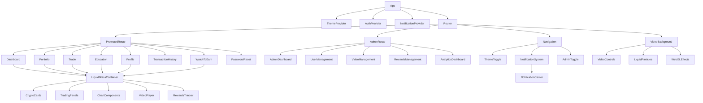
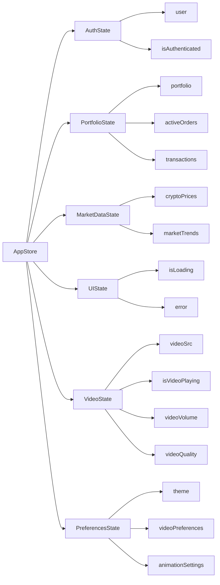
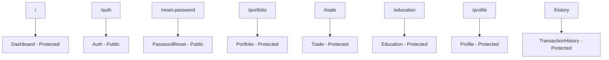
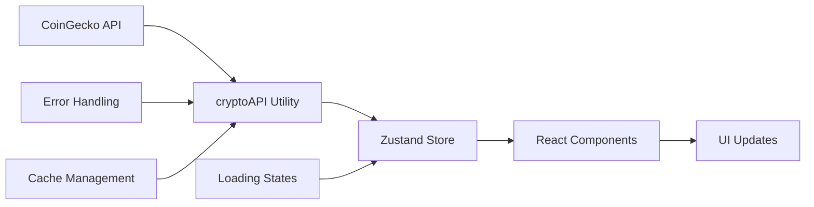

# CryptoVest Platform - MVP Design Document

## Overview

CryptoVest is a revolutionary cryptocurrency investment platform featuring liquid glass animations, live video backgrounds, and an innovative "watch-to-earn" crypto rewards system. Built as a React-based application with TypeScript, the platform combines immersive visual experiences with comprehensive admin functionalities and gamified learning mechanisms.

The platform features advanced liquid glass animations that create smooth, fluid transitions throughout the interface, comprehensive admin panel for content and user management, and a unique rewards system where users earn cryptocurrency by watching educational videos posted by administrators.

### Key Platform Features
- **Liquid Glass Animation System**: Smooth, fluid transitions with advanced CSS and WebGL effects
- **Admin Management Panel**: Complete administrative control over users, content, and rewards
- **Watch-to-Earn System**: Users earn crypto tokens by watching educational videos
- **Advanced Authentication**: Multi-level authentication with role-based access control
- **Real-time Trading**: Live cryptocurrency trading with professional-grade tools
- **Immersive Video Backgrounds**: Dynamic, high-quality video experiences

## Technology Stack & Dependencies

### Core Framework
- **React 18.2.0** with TypeScript for type-safe component development
- **Vite** as the build tool for fast development and optimized production builds
- **React Router DOM 6.20.1** for client-side routing and navigation

### State Management & Data Flow
- **Zustand 4.4.7** for global state management
- **React Context API** for authentication and theme management
- **Custom hooks** for notification systems and component logic

### Styling & Animation
- **Tailwind CSS 3.3.6** with custom crypto-themed color palette
- **Framer Motion 10.16.16** for smooth animations and transitions
- **Three.js** for WebGL-based liquid glass effects and 3D animations
- **GSAP (GreenSock)** for advanced liquid animation sequences
- **CSS Houdini** for custom paint worklets and dynamic effects
- **Liquid glass morphism design pattern** with advanced fluid transitions
- **Responsive design** supporting mobile, tablet, and desktop viewports

### Data Visualization & Charts
- **Chart.js 4.4.1** with React wrapper for portfolio analytics
- **React Chartjs 2 5.2.0** for interactive price charts
- **Custom trading indicators** and market trend visualizations

### API Integration & External Services
- **Axios 1.6.2** for HTTP client functionality
- **CoinGecko API** integration for real-time cryptocurrency prices
- **Pexels Video API** for dynamic background video content
- **Live streaming capabilities** for video backgrounds
- **JWT Token Management** for secure authentication
- **Admin API Endpoints** for content and user management
- **Rewards API** for crypto earning and distribution system
- **Video Analytics API** for tracking watch time and engagement

## Component Architecture

### Component Hierarchy

### Core Components Definition

#### VideoBackground Component
**Purpose**: Provides immersive live video backgrounds with interactive controls
**Props**: 
- `className?: string` - Custom styling classes

**Features**:
- Multiple high-quality crypto-themed video sources from Pexels
- Automatic failover between video sources on loading errors
- User-controllable play/pause functionality
- Volume control with mute capabilities
- Dynamic video source switching
- Loading states and error handling
- Floating crypto particle animations overlay
- Responsive video scaling and optimization

**State Management**:
- Video source URL
- Play/pause state
- Volume level (0.0 - 1.0)
- Loading status
- Error handling state

#### Navigation Component
**Purpose**: Main navigation bar with glass morphism design
**Features**:
- CryptoVest branding with Bitcoin icon
- Navigation items: Dashboard, Portfolio, Trade, Education
- User profile section with portfolio value display
- Notification bell with unread count indicator
- Theme toggle functionality
- Logout functionality

#### GlassContainer Component
**Purpose**: Reusable glass morphism container for content sections
**Props**:
- `children: ReactNode` - Content to be rendered
- `className?: string` - Additional styling
- `animationDelay?: number` - Staggered animation timing

#### ProtectedRoute Component
**Purpose**: Route protection based on authentication status
**Props**:
- `children: ReactNode` - Protected content
- `requireAuth?: boolean` - Whether authentication is required

### Page Components Structure

#### Dashboard Component
**Purpose**: Main overview page with market data and portfolio summary
**Sections**:
- Welcome message with user greeting
- Portfolio value summary cards
- Top cryptocurrencies market overview with live prices
- Recent transaction activity
- Quick action buttons for trading and portfolio management

#### Portfolio Component  
**Purpose**: Detailed portfolio management and asset tracking
**Sections**:
- Total portfolio value with time range selection (24h, 7d, 30d, 1y)
- Asset allocation breakdown
- Individual cryptocurrency holdings with quantity and value
- Performance metrics and percentage changes
- Add new asset functionality

#### Trade Component
**Purpose**: Cryptocurrency trading interface with real-time data
**Sections**:
- Cryptocurrency selection grid with price information
- Interactive price charts (placeholder for future implementation)
- Trading panel with buy/sell options
- Order type selection (Market/Limit orders)
- Amount input with quick selection buttons
- Total cost calculation
- Order execution functionality

#### Education Component
**Purpose**: Educational content and learning resources
**Features**:
- Cryptocurrency basics and investment guides
- Market analysis tutorials
- Risk management education
- Interactive learning modules

#### Profile Component
**Purpose**: User account management and preferences
**Features**:
- Personal information management
- Security settings including 2FA setup
- Notification preferences
- Video background preferences
- Account verification status

### State Management Architecture

#### Global Store Structure (Zustand)

#### Context Providers

**AuthContext**:
- User authentication state
- Login/logout functionality
- User profile data
- Authentication tokens

**ThemeContext**:
- Dark/light theme switching
- Theme persistence
- Dynamic CSS custom properties

**NotificationProvider**:
- System notifications management
- Toast messages
- Alert systems
- Notification history

## Routing & Navigation

### Route Structure

### Navigation Flow
- **Public Routes**: Authentication and password reset pages
- **Protected Routes**: All main application features require authentication
- **Route Guards**: ProtectedRoute component handles access control
- **Navigation State**: Active route highlighting in navigation bar
- **Deep Linking**: Full support for direct URL access to protected routes

## Styling Strategy

### Glass Morphism Design System

#### Color Palette
- **Primary**: `crypto-400` to `crypto-600` gradient (teal/cyan spectrum)
- **Background**: Dark theme with transparency layers
- **Glass Elements**: `backdrop-blur` with opacity variations
- **Accent Colors**: Bitcoin orange, Ethereum purple, success green, error red

#### Component Styling Classes
- **`.glass`**: Base glass morphism effect with backdrop blur
- **`.glass-button`**: Interactive glass buttons with hover effects
- **`.glass-navbar`**: Navigation bar with enhanced glass styling
- **`.glass-card`**: Content containers with glass morphism
- **`.video-background`**: Video element with overlay effects
- **`.crypto-particle`**: Floating animation elements

#### Responsive Design Breakpoints
- **Mobile**: 0-768px (single column layouts)
- **Tablet**: 768px-1024px (adapted grid systems)
- **Desktop**: 1024px+ (full multi-column layouts)

### Animation Strategy
- **Framer Motion**: Page transitions and component animations
- **Staggered Animations**: Sequential component loading with delays
- **Hover Effects**: Interactive micro-animations on buttons and cards
- **Loading States**: Smooth loading indicators and skeleton screens

## API Integration Layer

### Cryptocurrency Data Integration

#### CoinGecko API Integration
**Endpoint**: `/coins/markets`
**Features**:
- Real-time cryptocurrency prices
- 24h price change percentages
- Market capitalization data
- Trading volume information
- Historical price data

#### Data Flow Architecture

### Video Content Integration

#### Pexels Video API
**Purpose**: Dynamic crypto-themed background videos
**Features**:
- High-quality financial and technology videos
- Multiple resolution options
- Automatic source switching
- Error handling and fallbacks

#### Video Source Management
- **Primary Sources**: Curated crypto and financial technology videos
- **Fallback System**: Automatic switching on load failures
- **Quality Control**: Adaptive quality based on connection speed
- **User Controls**: Play/pause, volume, source selection

## Business Logic Architecture

### Authentication System
**Features**:
- Email/password authentication
- Two-factor authentication (2FA) with QR codes
- Password reset flow with email verification
- Session management and token handling
- User profile management

**Security Measures**:
- Input validation and sanitization
- Secure token storage
- HTTPS enforcement
- XSS protection
- CSRF protection

### Portfolio Management System

#### Asset Tracking
- **Real-time Value Calculation**: Live price updates for portfolio assets
- **Performance Metrics**: Gain/loss calculations with time-based analysis
- **Asset Allocation**: Visual breakdown of portfolio distribution
- **Transaction History**: Complete audit trail of all trades

#### Trading Logic
- **Order Types**: Market and limit order support
- **Price Calculation**: Real-time total cost computation
- **Validation**: Amount and balance verification
- **Execution Simulation**: Mock trading for MVP functionality

### Market Data Management
- **Price Updates**: Real-time cryptocurrency price feeds
- **Trend Analysis**: Market direction indicators
- **Historical Data**: Price history for charting
- **Market Statistics**: Volume, market cap, and change metrics

## Testing Strategy

### Unit Testing Framework
- **Jest**: Core testing framework for component logic
- **React Testing Library**: Component rendering and interaction testing
- **MSW (Mock Service Worker)**: API mocking for integration tests

### Test Coverage Areas

#### Component Testing
- **VideoBackground**: Video loading, controls, error handling
- **Navigation**: Route navigation, authentication states
- **Trading Components**: Order placement, validation logic
- **Portfolio Components**: Asset calculations, display logic

#### Integration Testing
- **Authentication Flow**: Login, logout, registration processes
- **API Integration**: External service communication
- **State Management**: Store updates and component synchronization
- **Video Streaming**: Background video functionality

#### End-to-End Testing
- **User Journeys**: Complete user workflows from login to trading
- **Cross-browser Testing**: Compatibility across modern browsers
- **Responsive Testing**: Mobile and desktop user experiences
- **Performance Testing**: Load times and video streaming performance

### Testing Best Practices
- **Component Isolation**: Individual component testing in isolation
- **Mock External Dependencies**: API calls and external services
- **Accessibility Testing**: Screen reader compatibility and keyboard navigation
- **Visual Regression Testing**: UI consistency across updates

## Performance Optimization

### Video Background Optimization
- **Lazy Loading**: Delayed video loading until viewport entry
- **Compression**: Optimized video files for web delivery
- **Adaptive Quality**: Resolution adjustment based on device capabilities
- **Bandwidth Management**: Progressive enhancement for slower connections

### Code Splitting & Bundling
- **Route-based Splitting**: Separate bundles per major route
- **Component Lazy Loading**: Dynamic imports for large components
- **Tree Shaking**: Unused code elimination
- **Bundle Analysis**: Regular bundle size monitoring

### State Management Optimization
- **Selective Updates**: Component re-rendering optimization
- **Memory Management**: Proper cleanup of subscriptions and timers
- **Caching Strategy**: Intelligent data caching for API responses
- **Virtual Scrolling**: Performance optimization for large lists

### API Performance
- **Request Debouncing**: Preventing excessive API calls
- **Response Caching**: Local storage of frequently requested data
- **Error Retry Logic**: Automatic retry with exponential backoff
- **Connection Pooling**: Efficient HTTP connection management

## Security Considerations

### Data Protection
- **Input Sanitization**: All user inputs validated and sanitized
- **XSS Prevention**: Content Security Policy implementation
- **HTTPS Enforcement**: Secure communication protocols
- **Sensitive Data Handling**: Secure storage of authentication tokens

### Authentication Security
- **Password Policies**: Strong password requirements
- **Two-Factor Authentication**: Additional security layer with TOTP
- **Session Management**: Secure token lifecycle management
- **Account Lockout**: Protection against brute force attacks

### API Security
- **Rate Limiting**: Request throttling to prevent abuse
- **CORS Configuration**: Proper cross-origin resource sharing setup
- **API Key Management**: Secure handling of external service keys
- **Input Validation**: Server-side validation of all API requests

### Content Security
- **Video Source Validation**: Verification of video content sources
- **External Resource Control**: CSP headers for external resources
- **User-Generated Content**: Sanitization of any user inputs
- **Error Information**: Sanitized error messages to prevent information leakage